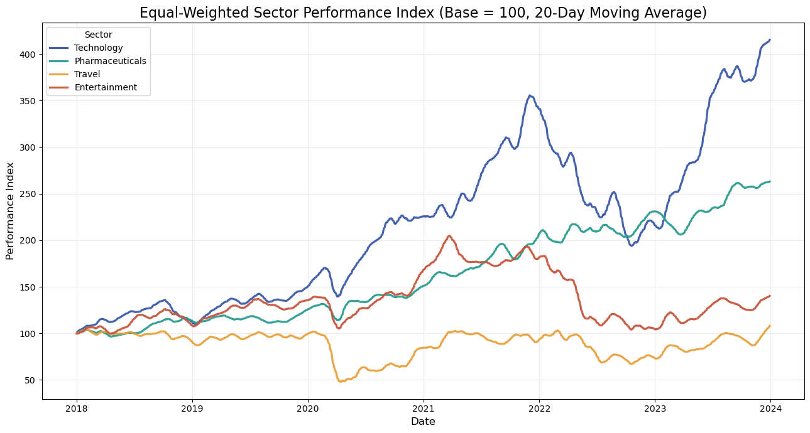
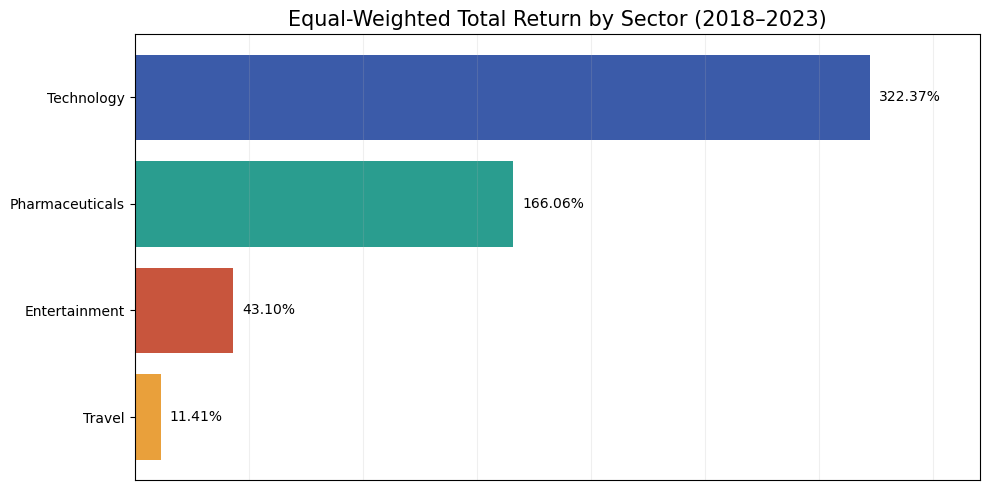
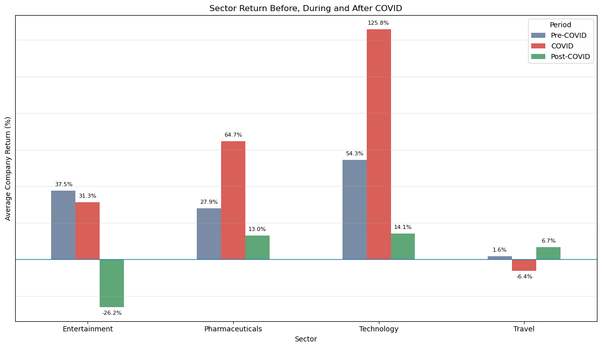
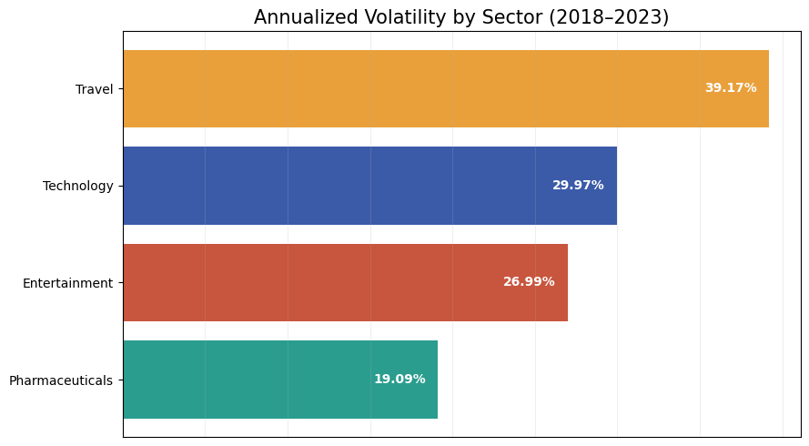
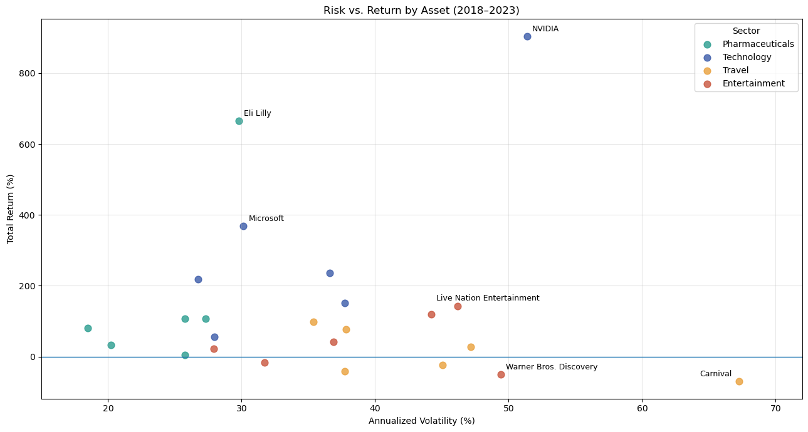
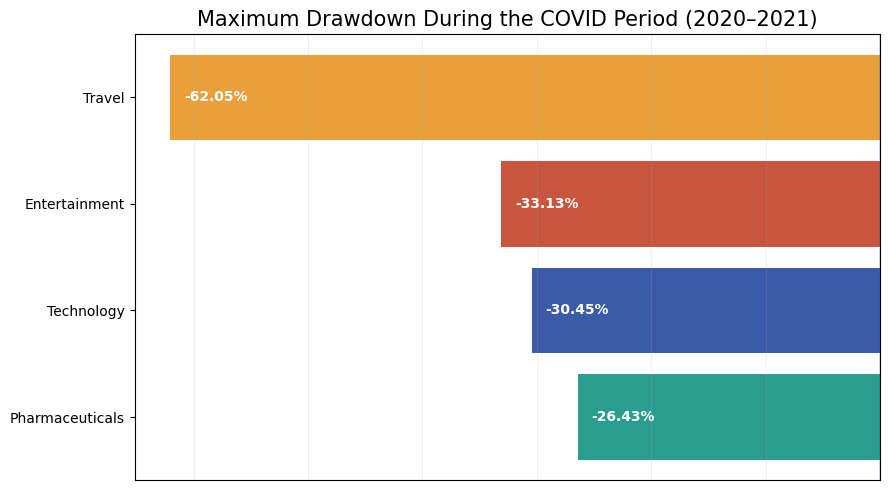
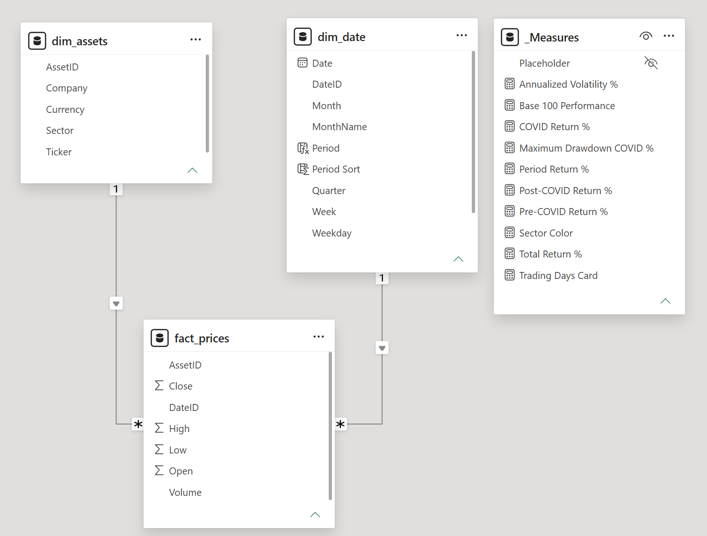
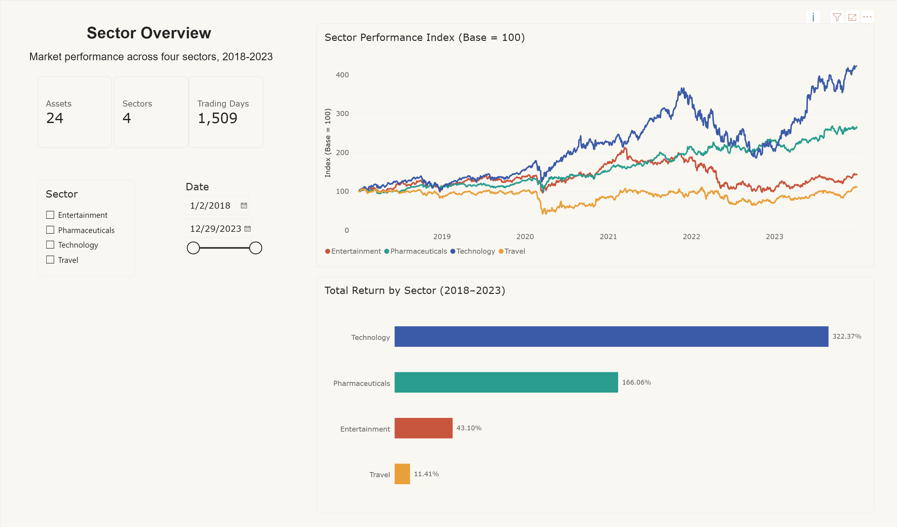
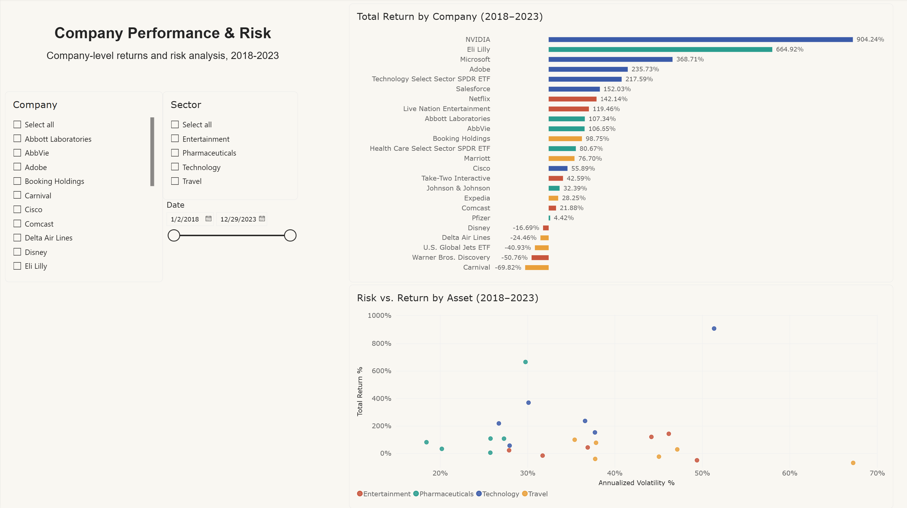
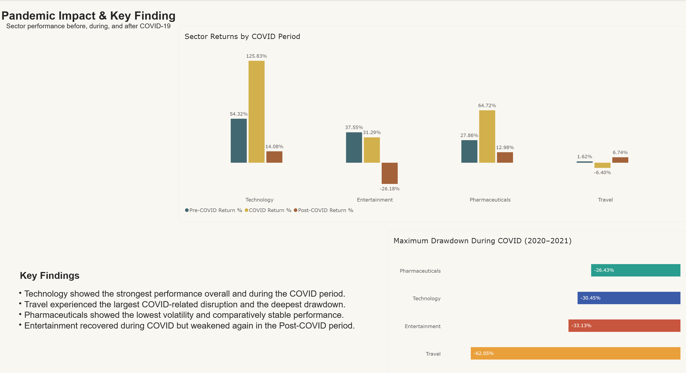

# Auswirkungen der COVID-19-Pandemie auf Marktsektoren (2018–2023)

**Sprache:** Deutsch | [English](README.md)

Dieses Portfolio-Projekt analysiert, wie sich vier Marktsektoren — **Technologie, Pharma, Reisen und Unterhaltung** — vor, während und nach der COVID-19-Pandemie entwickelt haben.

Das Projekt entstand ursprünglich als Abschlussprojekt eines sechsmonatigen Data-Analytics-Bootcamps. Die ursprüngliche Python-Analyse war mein Hauptbeitrag. Für diese Portfolio-Version habe ich das Notebook bereinigt und erweitert, die Sektormethodik auf einen **gleichgewichteten Ansatz** korrigiert, Risikoanalysen ergänzt und auf Basis desselben Star-Schema-Datenmodells ein neues interaktives **Power-BI-Dashboard** selbst erstellt.

## Wichtigste Ergebnisse

- **Technologie** erzielte mit 322,37% die stärkste gleichgewichtete Gesamtrendite, vor **Pharma** mit 166,06%.
- **Unterhaltung** erreichte 43,10%, **Reisen** 11,41%.
- **Reisen** war während der COVID-Phase der einzige Sektor mit negativer durchschnittlicher Rendite (-6,40%) und hatte zugleich den tiefsten Drawdown (-62,05%).
- **Pharma** verband solide Renditen mit der niedrigsten annualisierten Volatilität der vier Sektoren (19,09%).
- Auf Unternehmensebene waren **NVIDIA** (904,24%), **Eli Lilly** (664,92%) und **Microsoft** (368,71%) die stärksten Werte, **Carnival** (-69,82%) und **Warner Bros. Discovery** (-50,76%) die schwächsten.

## Projektübersicht

| Punkt | Umfang |
|---|---|
| Sektoren | 4 |
| Assets | 24 Aktien und ETFs, 6 pro Sektor |
| Analysezeitraum | Januar 2018 – Dezember 2023 |
| Handelstage | 1.509 |
| Preisbeobachtungen | 36.216 |
| Datenmodell | Star Schema mit einer Fakt- und zwei Dimensionstabellen |
| Hauptanalyse | Python / Jupyter Notebook |
| Interaktive Erweiterung | Power BI |
| Haupttools | Python, pandas, Matplotlib, yfinance, Jupyter, Power BI, DAX |

## Forschungsfragen

Die Analyse konzentriert sich auf vier Fragen:

1. Wie entwickelten sich die vier Sektoren über den gesamten Zeitraum 2018–2023?
2. Welche einzelnen Unternehmen erzielten die stärkste bzw. schwächste Performance?
3. Wie unterschieden sich die Sektorrenditen zwischen **Pre-COVID**, **COVID** und **Post-COVID**?
4. Wie unterschied sich das Risiko zwischen Sektoren und einzelnen Assets, gemessen an annualisierter Volatilität und Maximum Drawdown?

## Daten und Methodik

Historische Marktdaten werden mit `yfinance` von Yahoo Finance für den Zeitraum **2018-01-01** bis **2024-01-01** heruntergeladen. Das Enddatum ist exklusiv, sodass die vollständigen Jahre 2018–2023 abgedeckt werden.

Im Notebook wird `auto_adjust=True` verwendet, sodass adjustierte OHLC-Preise konsistent genutzt werden.

Jeder Sektor enthält sechs Assets. Technologie, Pharma und Reisen enthalten jeweils einen Sektor-ETF; Unterhaltung besteht aus sechs Einzelunternehmen.

### Konstruktion der Sektoren

Für die zentrale Sektor-Performance wird eine **gleichgewichtete Methodik** verwendet:

1. Jedes Asset wird zunächst einzeln auf einen Startwert von 100 normalisiert.
2. Anschließend werden die normalisierten Asset-Reihen innerhalb jedes Sektors gemittelt.
3. Die Sektor-Gesamtrendite basiert auf dem Durchschnitt der einzelnen Asset-Renditen.

Dadurch erhalten Aktien mit einem höheren absoluten Kurs nicht automatisch ein größeres Gewicht.

### Periodendefinition

Der sechsjährige Zeitraum wird in drei gleich lange Phasen eingeteilt:

- **Pre-COVID:** 2018–2019
- **COVID:** 2020–2021
- **Post-COVID:** 2022–2023

Diese Einteilung ist eine analytische Vereinfachung und kein statistisch identifizierter Strukturbruch.

### Renditeberechnung

Für ein einzelnes Asset oder eine Periode:

`(Endwert / Startwert − 1) × 100`

### Risikoanalyse

Die annualisierte Volatilität wird berechnet als:

`Standardabweichung der täglichen Renditen × √252`

Der Maximum Drawdown misst den größten Rückgang von einem vorherigen kumulativen Höchststand.

---

# Python- / Jupyter-Analyse

Das Jupyter Notebook ist der **zentrale analytische Teil des Projekts**. Es enthält den vollständigen Workflow vom Marktdaten-Download und der Bereinigung über EDA und Risikoanalyse bis zur Interpretation und zum Export des dimensionalen Datenmodells.

## 1. Gleichgewichteter Sektor-Performance-Index



Alle Assets werden zunächst einzeln auf 100 normalisiert und anschließend innerhalb ihres Sektors gemittelt.

Technologie zeigt die stärkste langfristige Entwicklung, während der Reisesektor während des Marktschocks 2020 besonders deutlich einbricht.

## 2. Gleichgewichtete Gesamtrendite nach Sektor



| Sektor | Gesamtrendite |
|---|---:|
| Technologie | 322,37% |
| Pharma | 166,06% |
| Unterhaltung | 43,10% |
| Reisen | 11,41% |

Technologie entwickelte sich über den gesamten Zeitraum deutlich stärker als die übrigen Sektoren.

## 3. Renditen vor, während und nach COVID



Dies ist der zentrale Vergleich des Projekts.

| Sektor | Pre-COVID | COVID | Post-COVID |
|---|---:|---:|---:|
| Technologie | 54,32% | 125,83% | 14,08% |
| Pharma | 27,86% | 64,72% | 12,98% |
| Unterhaltung | 37,55% | 31,29% | -26,18% |
| Reisen | 1,62% | -6,40% | 6,74% |

Technologie und Pharma entwickelten sich während der COVID-Phase besonders stark. Reisen war in dieser Phase der einzige Sektor mit einer negativen durchschnittlichen Rendite. Unterhaltung entwickelte sich in der Post-COVID-Phase deutlich negativ.

## 4. Annualisierte Volatilität nach Sektor



| Sektor | Annualisierte Volatilität |
|---|---:|
| Pharma | 19,09% |
| Unterhaltung | 26,99% |
| Technologie | 29,97% |
| Reisen | 39,17% |

Reisen hatte die höchste annualisierte Volatilität, während Pharma unter den vier ausgewählten Sektoren die stabilste Kursentwicklung zeigte.

## 5. Risiko vs. Rendite nach Asset



Das Scatterplot vergleicht die Gesamtrendite jedes Assets mit seiner annualisierten Volatilität.

- **NVIDIA** erzielte mit 904,24% die stärkste Rendite.
- **Eli Lilly** erreichte 664,92%.
- **Microsoft** erreichte 368,71%.
- Hohe Volatilität führte nicht automatisch zu hohen Renditen: **Carnival** und **Warner Bros. Discovery** kombinierten vergleichsweise hohes Risiko mit negativer Gesamtperformance.

## 6. Maximum Drawdown während COVID



| Sektor | Maximum Drawdown |
|---|---:|
| Reisen | -62,05% |
| Unterhaltung | -33,13% |
| Technologie | -30,45% |
| Pharma | -26,43% |

Reisen verzeichnete während der COVID-Phase mit Abstand den stärksten Drawdown. Pharma zeigte den geringsten Rückgang.

## Performance einzelner Unternehmen

Das Notebook enthält zusätzlich ein vollständiges Ranking der einzelnen Assets.

Zu den stärksten Werten gehören:

- NVIDIA: 904,24%
- Eli Lilly: 664,92%
- Microsoft: 368,71%

Zu den schwächsten Werten gehören:

- Carnival: -69,82%
- Warner Bros. Discovery: -50,76%
- U.S. Global Jets ETF: -40,93%

Diese Entwicklungen dürfen nicht ausschließlich als Folge der Pandemie interpretiert werden. Auch Branchentrends, Zinsen, Inflation, technologische Entwicklungen, unternehmensspezifische Ereignisse und andere Marktfaktoren beeinflussten die Ergebnisse.

---

# Star Schema

Die bereinigten Marktdaten werden in ein dimensionales Modell überführt.



| Tabelle | Rolle | Wichtige Felder |
|---|---|---|
| `fact_prices` | Faktentabelle | `AssetID`, `DateID`, Open, High, Low, Close, Volume |
| `dim_assets` | Asset-Dimension | `AssetID`, Company, Sector, Ticker, Currency |
| `dim_date` | Datumsdimension | `DateID`, Date, Year, Quarter, Month, Weekday, Period |

Beziehungen:

- `dim_assets (1) → fact_prices (*)`
- `dim_date (1) → fact_prices (*)`

Das Feld `Period` ordnet jeden Handelstag der Pre-COVID-, COVID- oder Post-COVID-Phase zu. Es ist einmal in der Datumsdimension definiert, sodass die Periodenlogik in Python und Power BI identisch ist.

Das Power-BI-Modell enthält zusätzlich eine eigene `_Measures`-Tabelle für DAX-Measures.

## Datenqualität

Das Notebook prüft die Daten vor der Analyse.

- **24 Assets**
- **1.509 Handelstage**
- **36.216 Beobachtungen**
- **0 fehlende Werte**
- vollständige `AssetID`- und `DateID`-Beziehungen
- keine doppelten Asset-/Datums-Kombinationen in der exportierten Faktentabelle

---

# Interaktives Power-BI-Dashboard

Nach Abschluss der Python-Analyse habe ich zusätzlich einen Power-BI-Bericht auf Basis der exportierten Star-Schema-Tabellen erstellt. Power BI ist eine **interaktive Erweiterung der Python-Analyse**, nicht deren Ersatz.

Der Bericht enthält drei Seiten.

## Seite 1 — Sector Overview



Diese Seite zeigt eine interaktive Sektorübersicht mit:

- gleichgewichtetem Base-100-Performance-Index
- Gesamtrendite nach Sektor
- Sektor- und Datumsfiltern
- kompakten Datensatz-Kennzahlen

## Seite 2 — Company Performance & Risk



Diese Seite geht von der Sektor- auf die Unternehmensebene:

- vollständiges Company-Return-Ranking
- Risk-vs.-Return-Scatterplot
- Company-, Sector- und Date-Filter

## Seite 3 — Pandemic Impact & Key Findings



Diese Seite beantwortet den Pandemie-Vergleich direkt:

- Pre-COVID-, COVID- und Post-COVID-Renditen
- Maximum Drawdown während 2020–2021
- kurze Key Findings

Der Power-BI-Bericht verwendet DAX-Measures für gleichgewichtete Renditen, Base-100-Performance, annualisierte Volatilität, Periodenrenditen und COVID-Drawdown.

---

# Limitationen

- Absolute Aktienkurse sind zwischen Unternehmen nicht direkt vergleichbar; deshalb werden für die zentralen Vergleiche normalisierte Werte und prozentuale Renditen verwendet.
- Drei Sektoren enthalten jeweils einen ETF, während Unterhaltung aus sechs Einzelunternehmen besteht; die Sektorzusammensetzung ist daher nicht vollständig äquivalent.
- Pre-COVID, COVID und Post-COVID sind vordefinierte analytische Kategorien und keine statistisch identifizierten Strukturbrüche.
- Die beobachteten Marktentwicklungen können nicht ausschließlich der Pandemie zugeschrieben werden.
- Die Analyse umfasst 24 ausgewählte Assets und soll nicht den gesamten Markt repräsentieren.
- Die Assets wurden rückblickend und nicht zufällig ausgewählt; dadurch kann Selektionsbias entstehen.
- `dim_date` enthält nur Handelstage und ist keine lückenlose Kalendertabelle für Standard-DAX-Zeitintelligenz.
- Ein neuer Yahoo-Finance-Download kann spätere Corporate Actions oder Änderungen adjustierter Preise berücksichtigen, sodass exakte Werte vom exportierten Projektdatensatz abweichen können.

# Dateien

- `covid_sector_analysis.ipynb` — vollständige Python-/Jupyter-Analyse
- `data/fact_prices.csv` — Faktentabelle mit 36.216 Zeilen
- `data/dim_assets.csv` — Asset-Dimension mit 24 Zeilen
- `data/dim_date.csv` — Datumsdimension mit 1.509 Zeilen
- `covid_sector_analysis.pbix` — interaktiver Power-BI-Bericht
- `images/` — Notebook- und Power-BI-Grafiken

# Projekt ausführen

Die exportierten CSV-Dateien in `data/` erlauben es, das Projekt zu prüfen, ohne die Marktdaten erneut herunterzuladen.

```bash
pip install pandas matplotlib yfinance jupyter
jupyter notebook covid_sector_analysis.ipynb
```

Ein vollständiger Notebook-Lauf lädt die Marktdaten erneut von Yahoo Finance herunter und überschreibt die Dateien in `data/`.

## Konventionen

Code-Kommentare, Diagrammbeschriftungen und die englische Haupt-README sind auf Englisch gehalten, damit das Projekt auch international gelesen werden kann.

---

Dieses Projekt entstand als Data-Analytics-Bootcamp-Abschlussprojekt und wurde anschließend für das Portfolio bereinigt, erweitert und weiterentwickelt. Es stellt keine Anlageberatung dar.
